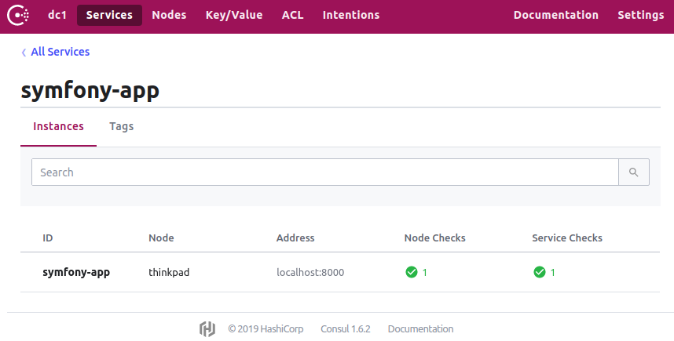

# Symfony Consul Bundle

Register and deregister your Symfony application in [Consul](https://consul.io)



## 1. Install

```bash
composer require akondas/symfony-consul-bundle
```

## 2. Configure

Enable this bundle in Symfony, add this line to your `bundles.php` file:

```php
Akondas\ConsulBundle\ConsulBundle::class => ['all' => true]
```

Add routing:

```yaml
consul_bundle:
  resource: '@ConsulBundle/Resources/config/routing.yml'
```

Configuration reference:

```bash
consul:
  service:
    name: 'subscription-service' # name of your app
    host: 'localhost' # host of your application under which it is available
    port: 8000 # port of your application under which it is available 
  client:
    base_uri: http://127.0.0.1:8500 # consule server uri
```

## 3. Use

Available commands:

 - `bin/console consul:register` - register application in Consul
 - `bin/console consul:deregister` - deregister application from Consul
 - `bin/console debug:consul-check` - debug Consul check 
